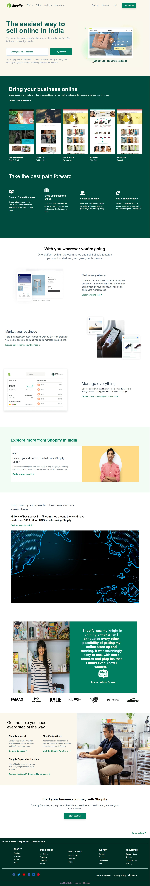

# Shopify-clone

[Shopify Clone](https://vinod-shopify.netlify.app/)

>  I learned from this project
    -   More about tailwind concepts navbars navbar properties, some animations, flex box, grid systems properties and positions and more and more tailwind classes.
---

## Duration of complete this project

-   Approx 3 days taken to complete this project and I am working as fulltime employee in non IT and I am working between night 7:30 to 11:00 PM.
-   Now I am fully confidenced to build any websites.

## **The website same as below image**

